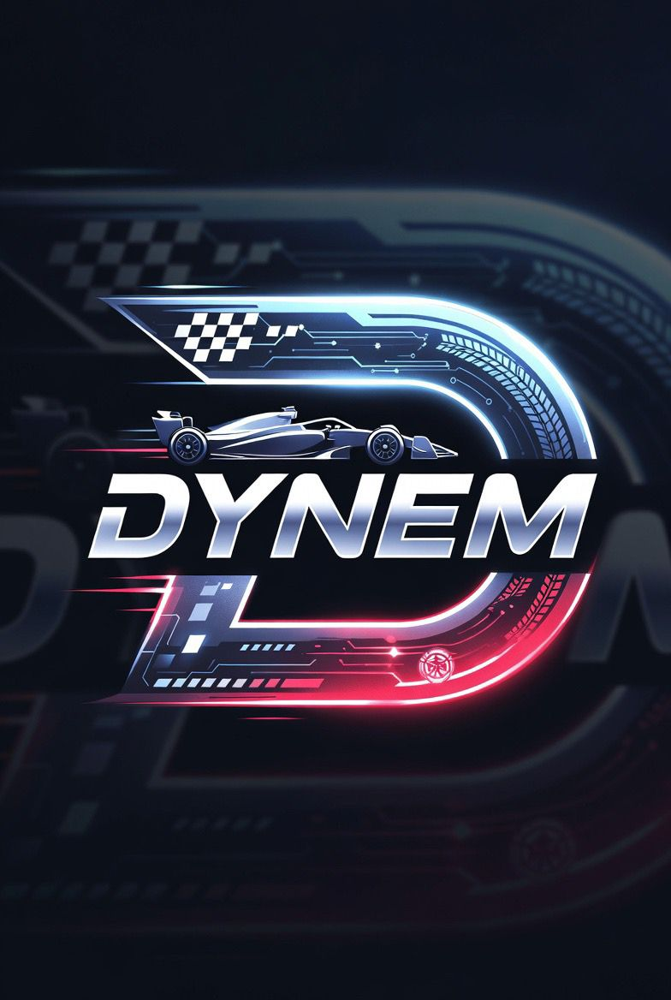
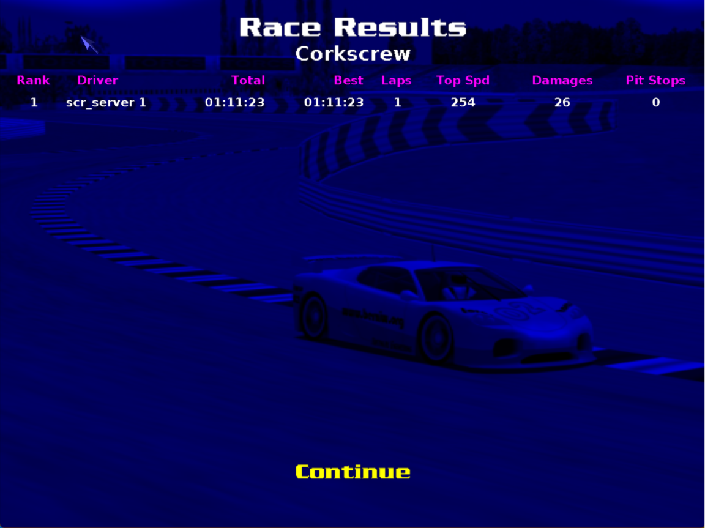

<div align="center">
  

  # DYNEM: Imitation Learning su TORCS
</div>

Il progetto **DYNEM** mira a sviluppare un agente autonomo in grado di guidare nel simulatore di corse **TORCS** (The Open Racing Car Simulator) utilizzando tecniche di **Imitation Learning** (Behavioral Cloning).

Attraverso la registrazione di dati di guida umana (es. tramite controller DualShock 4), abbiamo collezionato uno storico di stati della vettura e delle corrispondenti azioni (sterzo, acceleratore, freno). Questi dati sono stati successivamente impiegati per addestrare un modello di Machine Learning (usando il **K-Nearest Neighbors**) capace di mappare in tempo reale le letture dei sensori di bordo in azioni di guida autonome, con l'obiettivo di completare giri di pista sul circuito *Corkscrew* nel miglior tempo possibile.

---

## 🏆 Risultati e Tempo Finale

L'agente ha imparato a guidare sul circuito mantenendo buone performance e riuscendo a completare il giro in autonomia con un tempo di 1 minuto 11 secondi e 23 secondi.

<div align="center">
  
</div>

---

## 📂 Struttura del Progetto

```text
gym_torcs/
├── dataset_laps/               # Dataset raccolto manualmente (100 CSV dei giri in pista)
├── docs/                       # Documentazione e appunti di progetto
├── img/                        # Immagini per il README e altri media
├── models/                     # Modelli addestrati (es. knn_model.pkl, scaler.pkl)
├── plots/                      # Grafici generati dall'analisi esplorativa (EDA)
├── manual_control_ds4.py       # Script di raccolta dati (guida tramite Joypad)
├── step1_prepare_data.py       # Preparazione del dataset (scelta giri migliori, dataset unito e pulito, normalizzazione e scaler)
├── step2_train_knn.py          # Addestramento del modello KNN
└── step3_knn_drive.py          # Agente autonomo per guidare in TORCS in tempo reale
```

---

## ⚙️ Prerequisiti e Installazione

Assicurati di avere un'installazione di Python funzionante (>= 3.8). Per installare le dipendenze richieste, esegui:

```bash
pip install pandas numpy scikit-learn matplotlib seaborn
```

Assicurati inoltre di avere **TORCS** installato e configurato per accettare connessioni via rete (protocollo UDP SCR).

---

## 🚀 Guida all'Uso

Il workflow si divide in tre fasi principali: preparazione dati, addestramento del modello e test in pista.

### 1. Preparazione dei Dati (`step1_prepare_data.py`)
Lo script unisce i file CSV presenti in `dataset_laps/`, effettua la pulizia dai dati non validi (es. istanti iniziali), normalizza le feature e genera i grafici di Analisi Esplorativa (salvati nella cartella `plots/`).

```bash
python step1_prepare_data.py
```

### 2. Addestramento del Modello (`step2_train_knn.py`)
Addestra un modello `KNeighborsRegressor` (KNN) multi-output (steer, accel, brake) utilizzando il dataset pulito generato nello step precedente. 

```bash
python step2_train_knn.py
```
*Tip: Usa il flag `--find-k` per cercare il valore k migliore tramite cross-validation, oppure specifica un k manualmente con `--k 5`. Di base k è impostato a 3.*

### 3. Agente in TORCS (`step3_knn_drive.py`)
Avvia TORCS, seleziona la modalità gara/pratica sul circuito "Corkscrew", e avvia lo script. L'agente si connetterà a TORCS e inizierà a guidare sfruttando le inferenze del modello.

```bash
python step3_knn_drive.py
```

## ⚠️ Problemi Noti e Sviluppi Futuri

- **Compounding Error**: Essendo l'agente basato su puro Imitation Learning offline, tende ad accumulare piccoli errori e, in situazioni mai viste (es. a bordo pista), potrebbe non sapere come rientrare in traiettoria.
- **Risoluzione problemi (DAgger)**: È possibile impiegare la tecnica *DAgger* per raccogliere dati di recupero intenzionali, insegnando al modello come correggere le sbandate.
- **Analisi della Scelta del Modello**: Sebbene il KNN sia un'ottima baseline interpretativa, il calcolo della distanza rallenta proporzionalmente alla crescita del dataset.
